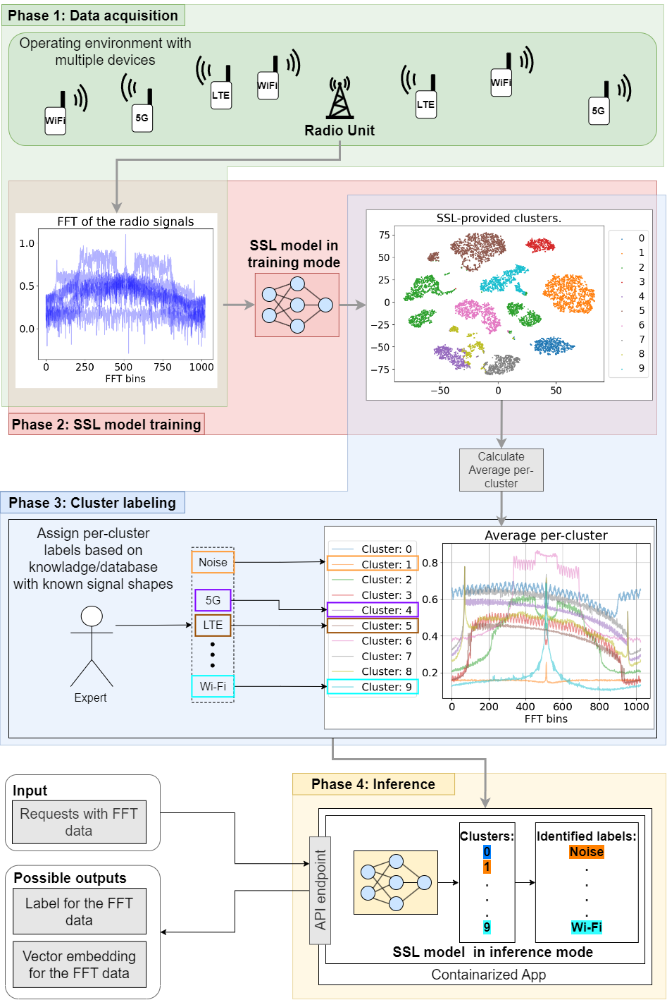

# SPIRE **S**elf-su**P**erv**I**sed Spect**R**um Cluste**R**ing

Code for the eperimental work as part of the paper: Spectrum Sensing with Deep Clustering: Label-Free Radio Access Technology Recognition.

Given the dynamic and complex nature of contemporary
wireless environments, characterized by a wide variety of
devices and multiple RATs, spectrum sensing is envisioned
to become a building component of future 6G, including as a components within O-RAN or digital twins.

In this work, we propose a new
spectrum sensing workflow in which the model training
does not require any prior knowledge of the RATs
transmitting in that area (i.e. no labelled data) and the
class assignment can be easily done through manual
mapping. Furthermore, we adaptat a SSL deep clustering architecture capable of autonomously extracting
spectrum features from raw 1D Fast Fourier Transform
(FFT) data. We evaluate the proposed architecture  on three real-world datasets from three European
cities, in the 868 MHz, 2.4 GHz and 5.9 GHz bands
containing over 10 RATs and show that the developed 
model achieves superior performance  by up to 35 percentage points with  22\% fewer trainable parameters
and 50\% less floating-point operations per second (FLOPS) compared to an SotA AE-based reference architecture.

# Self-supervised clustering-enabled spectrum sensing workflow



To run the expreiments:

1) Install dependencies:
     ```console
     pip install -r requriments.txt
     pip install -q pyclustertend==1.8.2 --ignore-requires-python --no-deps
     ```

3) Download the datasets to corresponding folders in data/
     ```console
    data/ITS: https://ieee-dataport.org/documents/dataset-iq-samples-lte-5g-nr-wi-fi-its-g5-and-c-v2x-pc5
    data/TCD: https://github.com/JaronFontaine/Technology-Recognition-dataset-of-real-life-LTE-WiFi-and-DVB-T
    data/LOG-a-TEC: https://log-a-tec.eu/
    ```
   
5) Do preproccesing of data:
     ```console
    data/ITS: python preprocess_data_its.py <dir_of_data>/ <your_dataset_name>.h5
    data/TCD: python preprocess_data_ghent.py <dir_of_data>/ <your_dataset_name>.h5
    data/TCD: python preprocess_data_logatec.py <filepath>.json <your_dataset_name>.h5
    ```

7) Run the notebooks
   
     

